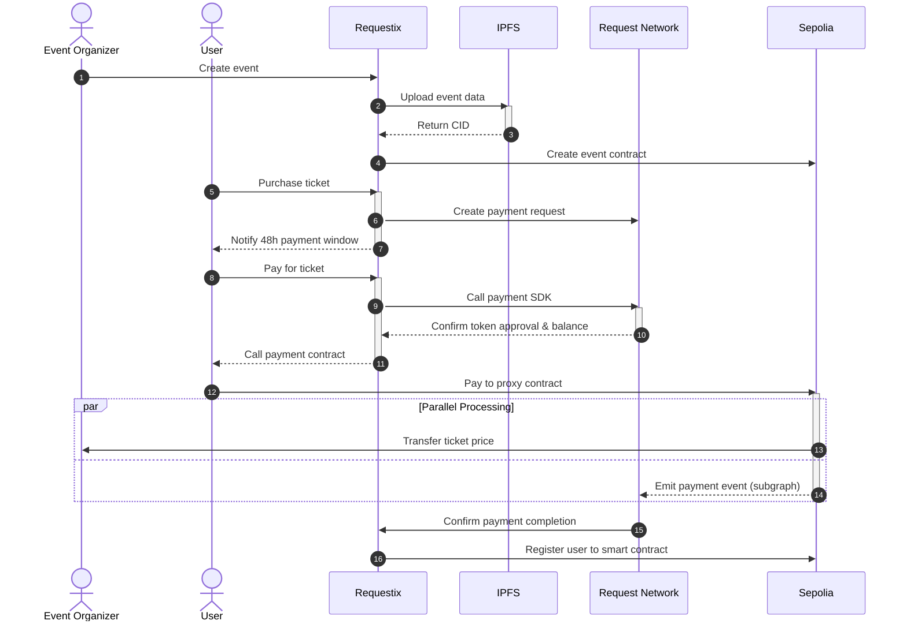

# Requestix

## Introduction
Requestix is a decentralized ticketing platform built on the Ethereum blockchain using the Request Network to facilitate seamless ticket purchases and payments. Users can buy tickets through payment requests generated by the platform, which must be paid within 48 hours. Upon payment confirmation, tickets are registered on a smart contract to validate the purchase. The platform also allows users to create and sell tickets for their own events, ensuring a secure and transparent process through blockchain technology. By leveraging the Request Network's decentralized payment system, Requestix reduces transaction fees and enhances the efficiency and transparency of the ticketing process.

## Problem Statement

* Limited transparency - Traditional systems lack clear transaction traceability and ticket ownership verification, making it difficult to track authentic ticket transfers and validate ownership.

* Poor user experience - Most blockchain platforms present complex technical interfaces and processes, creating significant barriers for non-technical users during ticket purchases.

* Security risks - Centralized control in existing systems makes them vulnerable to fraud, unauthorized reselling, and potential security breaches.

* Restricted flexibility - Event organizers face limitations in customizing ticket sales, managing transactions, and implementing specific event requirements efficiently.

## Solution

* **Enhanced Transaction Transparency**
  - Leverages Request Network to provide detailed transaction information
  - Ensures clear verification of ticket purchases and ownership
  - Prevents fraud and unauthorized reselling through transparent tracking

* **Efficient Payment Processing**
  - Minimizes transaction fees through Request Network integration
  - Enables faster payment confirmation and ticket delivery
  - Streamlines the entire purchasing workflow

* **User-Friendly Interface**
  - Provides intuitive platform for both buyers and organizers
  - Simplifies blockchain interactions for non-technical users
  - Direct linking between payments and ticket issuance

* **Decentralized Security**
  - Implements smart contract validation for all ticket transactions
  - Eliminates risks associated with centralized databases
  - Ensures tamper-proof ticket ownership records

* **Organizer Flexibility**
  - Offers customizable ticketing options for event management
  - Enables decentralized event creation and ticket sales
  - Maintains security while providing administrative control

## Architecture
